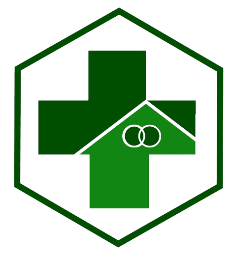

<!DOCTYPE html>
<html lang="en">
<head>
    <meta charset="UTF-8">
    <meta name="viewport" content="width=device-width, initial-scale=1.0">
    <title>Content Section</title>
    <link rel="stylesheet" href="styles.css">
</head>
<body>
    <header>
        

            <h1>PUSKESMAS MRANTI</h1>
        

        <nav>
            <ul>
                <li><a href="#">Info</a></li>
                <li><a href="#">Jam Kerja</a></li>
                <li><a href="#">Pelayanan</a></li>
                <li><a href="#">Dokumentasi</a></li>
                <li><a href="#">Pricing</a></li>
                <li><a href="#">Blog</a></li>
            </ul>
        </nav>
        <a href="#" class="contact-button">Contact</a>
    </header>

    <section class="intro">
        

            <h2>Hi, Selamat Datang di Puskesmas Mranti 👋</h2>
            
Kesehatan adalah harta yang tak ternilai 

            
Jangan abaikan, segera periksa ke puskesmas

            
Keluarga sehat, Indonesia kuat Mari dukung program kesehatan di puskesmas

            <a href="#" class="message-button">Pelajari Lebih Lanjut</a>
        

        

            
        

    </section>
    <section class="skills-section">
        

            Ways of working 💡
            <h2>Skills that I use to create world-class products</h2>
        

        

            

                

                    
                

                <h3>UX Design</h3>
                
From wireframes to user journeys I utilise various UX techniques to deliver world-class experience.

            

            

                

                    
                

                <h3>UI Design</h3>
                
To make outstanding UX work, it still needs polished visual design.

            

            

                

                    
                

                <h3>UX Research</h3>
                
I create interactive surveys, hold user interviews, and follow user data to find out what works and what not.

            

            

                

                    
                

                <h3>Prototyping</h3>
                
I build prototypes to quickly gather more feedback about products.

            

            

                

                    
                

                <h3>Workshops</h3>
                
I conduct workshops to come up with new ideas and to promote cross-functional ideation.

            

            

                

                    
                

                <h3>Collaboration</h3>
                
I bring positive energy to teams I work in and can communicate effectively about decisions we need to make.

            

        

    </section>    
</body>
</html>
